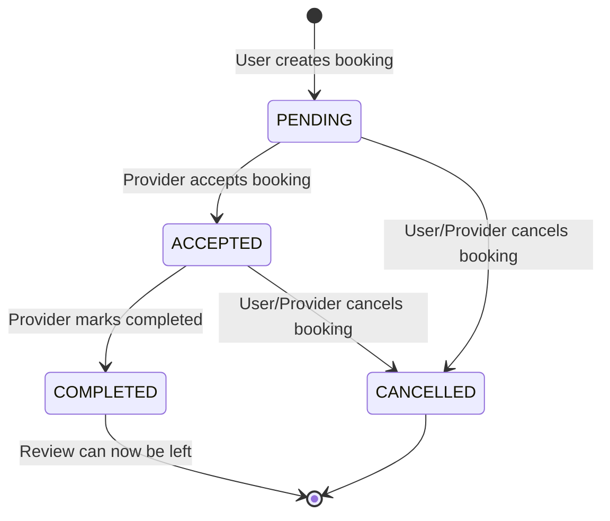

# Product Requirement Document (PRD): Everything Near Me

## 1. Document Control

| Metadata | Details |
| :--- | :--- |
| **Project Name** | Everything Near Me |
| **Document Version** | 1.0.0 |
| **Date** | May 24, 2026 |
| **Status** | Draft |
| **Author** | Antigravity AI |

---

## 2. Executive Summary

### 2.1 Product Vision
**Everything Near Me** is a hyper-local, on-demand service discovery and booking platform that connects everyday consumers ("Users") with skilled local professionals ("Providers") like plumbers, electricians, and technicians. The platform aims to remove friction from local service commerce by offering instant, location-aware provider rankings, transparent reviews, and a streamlined booking process.

### 2.2 Problem Statement
Finding reliable local service providers is often fragmented, relying on word-of-mouth or outdated web directories that lack availability information, real-time distance sorting, or verified customer reviews. Conversely, local service providers struggle to find customers in their immediate vicinity, optimize their travel distances, and build a trust-based reputation online.

### 2.3 Objectives
- Provide users with an instant list of nearby, available service providers sorted by proximity, average rating, and job completion history.
- Enable providers to manage their profiles, toggle availability, define their operating service radius, and receive service requests.
- Foster high-trust interactions through a review and scoring loop.

---

## 3. User Personas & Target Audience

### 3.1 Service Seeker (User)
* **Demographics**: Homeowners, renters, or office managers needing immediate or scheduled repair/maintenance work.
* **Core Needs**: Fast response, verified ratings, transparent pricing/details, proximity calculations to understand arrival times.
* **Pain Points**: Dealing with unresponsive providers, lack of rating transparency, and surprise travel fees.

### 3.2 Service Provider (Provider)
* **Demographics**: Independent local tradespeople (plumbers, electricians, cleaners, locksmiths) or small service agencies.
* **Core Needs**: High visibility within a manageable travel distance, a reliable calendar of bookings, and a way to build local trust.
* **Pain Points**: Traveling too far for low-value jobs, managing scheduling conflicts, and difficulty competing with large marketing budgets.

---

## 4. Functional Requirements (User Stories & Epics)

### Epic 1: Identity & Authentication (Auth)
As a user or provider, I want to securely register, log in, and manage my session so that my personal details and booking history remain private and secure.

* **FR-1.1: Registration**
  - Users must be able to register with name, email, password, and role selection (`USER` or `PROVIDER`).
  - Providers must complete an extended registration including: `bio`, `serviceCategory` (e.g., Plumber, Electrician), and `serviceRadius` (in kilometers).
* **FR-1.2: Authentication**
  - Secure login using email and password, returning short-lived Access Tokens (15 min) and long-lived Refresh Tokens (7 days) in secure HTTP-only cookies.
  - Support password hashing using Bcrypt.
* **FR-1.3: Session Management & Logout**
  - Token refresh mechanism to keep users logged in during active usage.
  - Clean logout invalidating refresh tokens from the server and local storage.

### Epic 2: Geolocation & Provider Discovery
As a user, I want the system to locate me automatically and display ranked local service providers within my area so that I can make quick booking decisions.

* **FR-2.1: Automatic Geolocation**
  - Prompt the browser for `navigator.geolocation` permissions upon loading the home dashboard.
  - If denied, fall back gracefully to a manual coordinate or location input box.
* **FR-2.2: Nearby Search and Filtering**
  - Search by service category (dropdown/text search).
  - Compute distance using the **Haversine formula** (in kilometers) based on the user's location and provider's base coordinate.
  - Filter out providers whose distance exceeds their custom `serviceRadius` or who are toggled as "unavailable" (`isAvailable = false`).
* **FR-2.3: Provider Ranking (Score Algorithm)**
  - Sort search results descending by a server-side composite `score`:
    $$\text{score} = (\text{avgRating} \times 0.5) + (\log(\text{completedJobs} + 1) \times 0.3) + (\text{proximityScore} \times 0.2)$$
  - *Proximity Score*: Normalized inverse distance (closer providers get a score approaching 1.0, farther ones approach 0.0).
  - Sorting toggles: Sort by Score (default), Distance (ascending), or Rating (descending).

### Epic 3: Booking Workflow
As a user, I want to schedule a booking with a provider, and as a provider, I want to accept, complete, or reject that request to manage my workday.

* **FR-3.1: Booking Creation**
  - Users can select a date, time (`scheduledAt`), and add optional description `notes` on the provider's detail page.
* **FR-3.2: Booking Management Console**
  - Tabbed view: `Upcoming`, `Completed`, `Cancelled`.
  - Both users and providers can view lists of bookings relevant to them.
* **FR-3.3: Booking Status Updates**
  - Providers can update status from `PENDING` to `ACCEPTED`.
  - Providers can mark booking as `COMPLETED` when work is done, which automatically records `completedAt` timestamp.
  - Either party can update status to `CANCELLED` prior to completion.

### Epic 4: Reviews & Reputation System
As a user, I want to leave feedback after a service is completed, and as a provider, I want my rating and score updated automatically so that my online profile reflects my work quality.

* **FR-4.1: Review Submission**
  - A user can only review a provider after a booking status reaches `COMPLETED`.
  - One-to-one validation: Limit reviews to exactly one review per completed booking.
  - Rating scale: 1 to 5 stars + optional written comment.
* **FR-4.2: Real-time Profile Aggregation**
  - Recalculate provider profile statistics server-side upon review completion:
    - Update `avgRating` (mean of all ratings).
    - Update `completedJobs` (increment total completed count).
    - Recalculate composite ranking `score`.

---

## 5. User Interface & Design Requirements

### 5.1 Aesthetics & Styling
* **Design Motif**: Modern Glassmorphism.
* **Backgrounds**: Dark themed, utilizing smooth dark gradients (e.g., deep space blues, slate, and rich purples: `from-slate-900 via-purple-950 to-slate-900`).
* **Components**: Semi-transparent card panels (`bg-white/10 backdrop-blur-md border border-white/20 rounded-2xl`).
* **Accents**: Vibrant violet/indigo gradients (`from-violet-600 to-indigo-600`) for primary Call-to-Actions (CTAs) and interactive elements.
* **Typography**: Highly readable modern sans-serif typeface (e.g., *Inter* or *Geist*).
* **Interactions**: Smooth scale transitions on card hover, skeleton loaders during data fetch states, and clean toast alerts for feedback.

### 5.2 Core Frontend Pages
1. **`/login` & `/register`**: Split layout forms or centered glass panels. Register needs role toggles changing inputs depending on whether they are registering as a User or Provider.
2. **Dashboard (`/`)**: Main search portal. Map container (optional visual map integration or grid list view), active search bar, categories filter, and sorting toggles.
3. **Provider Detail (`/providers/[id]`)**: Displays provider bio, service stats, badge indicators (Availability), cumulative rating stars, full review log, and the "Book Now" action.
4. **My Bookings (`/bookings`)**: Organized list matching the status filter tabs, showing quick actions (e.g., "Cancel", "Accept", "Leave Review").
5. **My Profile (`/profile`)**: Form fields enabling profile editing, radius adjustment, availability switches, and location resetting.

---

## 6. Non-Functional Requirements

### 6.1 Performance & Latency
* The proximity search query (`/providers/nearby`) must load within **< 200ms** for active queries up to 20 returned providers.
* Database indexations on `latitude`, `longitude`, `userId`, `providerId`, and booking `status` must be present.
* The frontend must load efficiently by utilizing Next.js Server Components where possible, paired with lazy client-side hooks.

### 6.2 Security & Data Privacy
* **Encryption**: Passwords hashed using Bcrypt with a work factor of 12.
* **CORS Policy**: Strictly configure CORS to allow incoming traffic only from specified frontend origins.
* **SQL Injection Prevention**: All queries to the PostgreSQL database must use Prisma ORM's parameterized statements or parameterized raw SQL (`prisma.$queryRaw`).
* **Data Validation**: Enforce strict request schemas at backend routes via **Zod schemas**.

### 6.3 Infrastructure & Deployment
* **Dockerization**: Complete container setup containing separate `Dockerfile` components for the Next.js frontend, Express backend, and wire connections through a unified `docker-compose.yml` including Postgres and Redis (if used for cache/refresh-token invalidation tracking).
* **Environment Configuration**: Exhaustive `.env.example` documents indicating JWT secrets, database connection URLs, and client target URLs.

---

## 7. KPIs & Metrics to Track
1. **Conversion Rate**: Number of searches resulting in a booking request creation.
2. **Provider Activity**: Percentage of registered providers logging in and marking themselves available weekly.
3. **Completed Jobs Rate**: Percentage of `PENDING` bookings successfully transitioning to `COMPLETED` vs. `CANCELLED`.
4. **Average Search Latency**: Backend response duration for nearby geo-searches.

---

## 8. Out of Scope (Future Phases)
* **Integrated Payments**: Handling transactions directly within the platform.
* **In-app Chat**: Real-time communication socket system between User and Provider.
* **Real-time Map Tracking**: Live GPS sharing on map views showing provider location updates in transit.
