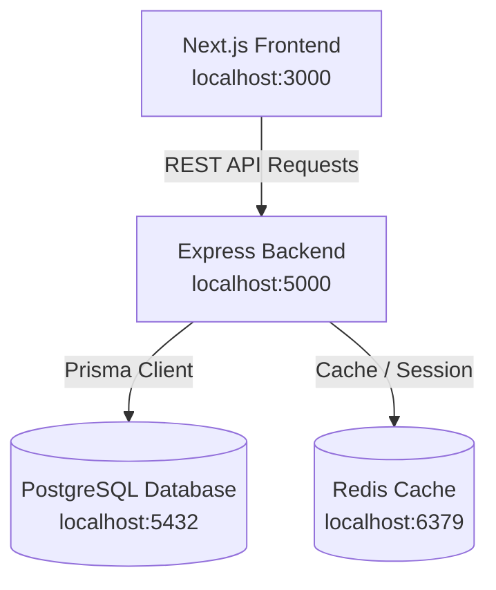

# ENM (Everything Near Me)


**ENM (Everything Near Me)** is a premium, hyper-local, on-demand service discovery and booking platform. It seamlessly connects consumers ("Users") looking for immediate or scheduled home maintenance with nearby, verified tradespeople ("Providers") like plumbers, electricians, cleaners, locksmiths, and HVAC technicians.

The platform provides automatic location-aware provider ranking, transparent ratings, a complete booking lifecycle, and a verified review feedback loop, all packaged in a stunning dark-themed glassmorphic UI.

---

## 🏗️ Architecture & Component Overview

The codebase is organized into a monorepo-style layout with two main components:
1. **`backend`**: Express.js server written in TypeScript utilizing **Prisma ORM** for PostgreSQL connection and database integrity.
2. **`frontend`**: Next.js App Router application built on React, TypeScript, and styled with premium, responsive glassmorphism using Tailwind CSS.



---

## ✨ Core Features

- **Secure Role-Based Authentication**: Secure sign-up/login using email and password. Generates short-lived Access Tokens (15 min) and long-lived Refresh Tokens (7 days) in secure HTTP-only cookies.
- **Location-Aware Search**: Instantly locates the client using `navigator.geolocation` (or lets them input coordinates manually) and uses the **Haversine formula** (via optimized backend SQL) to locate active providers within their custom service radius.
- **Provider Composite Ranking**: Ranks nearby service providers dynamically using a composite scoring formula:
  $$\text{score} = (\text{avgRating} \times 0.5) + (\log(\text{completedJobs} + 1) \times 0.3) + (\text{proximityScore} \times 0.2)$$
- **Interactive Booking Lifecycle**: Handles a full four-state workflow (`PENDING` ➔ `ACCEPTED`/`CANCELLED` ➔ `COMPLETED`).
- **Verified Review Loop**: Limits review submissions strictly to clients who have a `COMPLETED` booking with the provider. Submission recalculates the provider's average rating, total completed jobs, and ranking score instantly.
- **Stunning Dark-Theme UI**: Premium look and feel built on glass backdrop filters (`backdrop-blur-md bg-white/10`), smooth transition micro-animations, and responsive layouts.

---

## 📂 Repository Structure

```text
├── .gitignore
├── .env.example              # Root-level template for environment variables
├── docker-compose.yml        # Multi-container orchestration (DB, Redis, Backend, Frontend)
├── PRDs/
│   └── PRD.md                # Product Requirements Document
├── backend/
│   ├── Dockerfile            # Multi-stage production build configuration
│   ├── package.json
│   ├── tsconfig.json
│   ├── prisma/
│   │   └── schema.prisma     # Prisma database schemas (User, ProviderProfile, Booking, Review)
│   └── src/
│       ├── server.ts         # Server bootstrap
│       ├── controllers/      # Route controllers (Auth, Provider, Booking, Review)
│       ├── middleware/       # Authentication, validation, and error-handling middlewares
│       ├── prisma/           # Singleton Prisma client and database seed files
│       ├── routes/           # Express router endpoints
│       └── services/         # Business logic (Haversine math, dynamic ranking score computation)
└── frontend/
    ├── Dockerfile            # Standalone Next.js multi-stage build configurations
    ├── package.json
    ├── tailwind.config.ts
    └── src/
        ├── app/              # Next.js pages (homepage, profile, bookings, providers/[id], auth)
        ├── components/       # Visual glassmorphic components (ProviderCard, SearchBar, etc.)
        ├── hooks/            # Client-side hooks (useGeolocation, useNearbyProviders)
        └── lib/              # Client utilities (api client, auth validation)
```

---

## 🚀 Getting Started

### Prerequisites
Make sure you have the following installed:
- [Node.js](https://nodejs.org/) (v18+ recommended)
- [PostgreSQL](https://www.postgresql.org/) (running locally or via Docker)
- [Docker & Docker Compose](https://www.docker.com/) (Optional - for quick orchestration)

---

### Method A: Local Manual Setup

#### 1. Database Setup
Ensure PostgreSQL is running on your system.
1. Create a database named `enm`.
2. Generate your `.env` file in the `backend/` directory by copying `.env.example`:
   ```bash
   cp .env.example backend/.env
   ```
3. Update `DATABASE_URL` with your local database username and password:
   ```env
   DATABASE_URL="postgresql://<username>:<password>@localhost:5432/enm?schema=public"
   ```

#### 2. Backend Installation & Boot
1. Navigate to the backend folder:
   ```bash
   cd backend
   ```
2. Install dependencies:
   ```bash
   npm install
   ```
3. Generate the Prisma client & run database migrations to create tables:
   ```bash
   npx prisma db push
   ```
4. Seed the database with mock providers, users, bookings, and ratings:
   ```bash
   npm run db:seed
   ```
5. Launch the backend dev server (runs on `http://localhost:5000`):
   ```bash
   npm run dev
   ```

#### 3. Frontend Installation & Boot
1. Open a new terminal and navigate to the frontend folder:
   ```bash
   cd frontend
   ```
2. Install dependencies:
   ```bash
   npm install
   ```
3. Launch the Next.js development server (runs on `http://localhost:3000`):
   ```bash
   npm run dev
   ```

---

### Method B: Quickstart with Docker Compose

To orchestrate PostgreSQL, Redis, backend APIs, and the frontend server seamlessly in isolated containers:

1. Configure a `.env` file at the repository **root** (similar to the root `.env.example`).
2. Build and launch all services in detached mode:
   ```bash
   docker-compose up --build -d
   ```
3. The database, cache, backend server, and frontend will boot sequentially based on health checks:
   - **Frontend**: Accessible on [http://localhost:3000](http://localhost:3000)
   - **Backend API**: Accessible on [http://localhost:5000](http://localhost:5000)
4. (Optional) Run the database seed inside the running backend container:
   ```bash
   docker-compose exec backend npm run db:seed
   ```

---

## 🛠️ Verification & Compilation

Validate database schemas, TypeScript compilers, and standalone bundles locally using these checks:

```bash
# Validate Prisma schema configuration
cd backend
npx prisma validate

# Verify complete Backend compilation
npm run build

# Verify complete Frontend Next.js build compilation
cd ../frontend
npm run build
```
